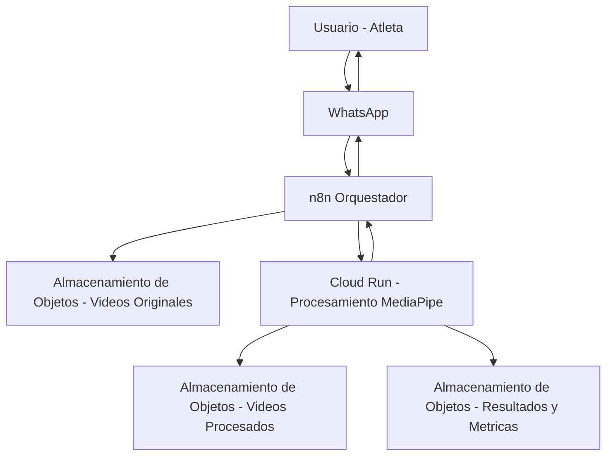

# Definición del Proyecto de Tesis

## Título del Proyecto

Asistente de Entrenamiento Basado en Inteligencia Artificial para el Aprendizaje de Movimientos de Calistenia mediante Visión por Computador, Arquitectura Evolutiva y Desarrollo Ágil

## Descripción General del Proyecto

Esta tesis propone el diseño, la implementación y la evaluación de un asistente de entrenamiento basado en inteligencia artificial, orientado a apoyar el aprendizaje de movimientos avanzados de calistenia mediante el análisis automatizado de video. El sistema utiliza técnicas de visión por computador y estimación de la pose humana para analizar grabaciones cortas de ejecuciones de movimientos y generar retroalimentación técnica para el atleta.

El proyecto sigue un proceso de desarrollo ágil estructurado en seis sprints de dos semanas y adopta un enfoque de Arquitectura Evolutiva. Las decisiones arquitectónicas se documentan de forma continua y se guían mediante funciones de ajuste explícitamente definidas, garantizando que la evolución del sistema sea controlada, medible y alineada con restricciones de rendimiento, costo, escalabilidad y robustez. Cada sprint entrega un incremento funcional del sistema, culminando en un Producto Mínimo Viable (MVP) validado.

## Objetivo General

Desarrollar y validar un asistente de entrenamiento basado en inteligencia artificial para movimientos de calistenia, aplicando técnicas de visión por computador dentro de un marco de arquitectura evolutiva, y evaluando su viabilidad técnica, económica y práctica mediante funciones de ajuste objetivas.

## Objetivos Específicos

### 1. Diseñar

Diseñar una arquitectura de sistema evolutiva para un asistente de entrenamiento basado en inteligencia artificial, definiendo y documentando decisiones arquitectónicas mediante diagramas y Registros de Decisiones Arquitectónicas (ADR), y estableciendo funciones de ajuste que gobiernen su evolución.

### 2. Implementar

Implementar un sistema funcional de extremo a extremo que procese videos cortos de calistenia mediante visión por computador y estimación de pose humana, generando tanto retroalimentación técnica como videos procesados de forma automatizada.

### 3. Medir

Medir la viabilidad técnica, económica y operativa del sistema mediante la evaluación experimental de las funciones de ajuste definidas, utilizando métricas objetivas sobre rendimiento, costo y capacidad de procesamiento.

## Alineación Objetivo–Medición

Los objetivos del proyecto se validan de la siguiente manera:

- Las funciones de ajuste arquitectónicas se definen y documentan durante el objetivo de arquitectura.
- La implementación del sistema materializa estas decisiones arquitectónicas en un pipeline funcional.
- El objetivo de evaluación mide si el sistema implementado satisface las funciones de ajuste previamente definidas bajo condiciones experimentales controladas.

Esta alineación garantiza que la intención arquitectónica, la implementación del sistema y la evaluación del sistema se mantengan coherentes a lo largo de todo el ciclo de desarrollo.

## Diagrama de Arquitectura

## Demo

