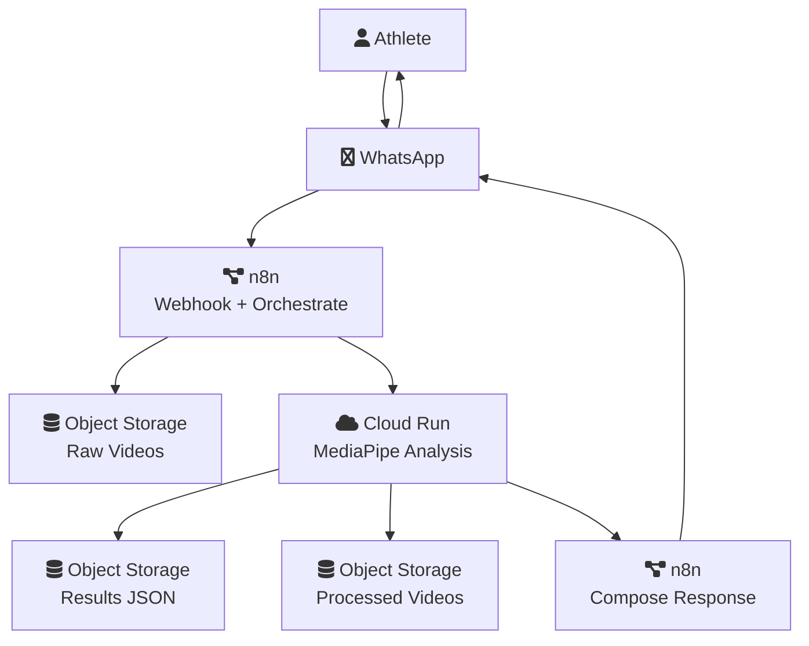

# Thesis Project Definition

## Project Title

AI-Based Training Assistant for Learning Calisthenics Movements Using Computer Vision, Evolutionary Architecture, and Agile Development

## Project Overview

This thesis proposes the design, implementation, and evaluation of an AI-based training assistant aimed at supporting the learning of advanced calisthenics movements through automated video analysis. The system leverages computer vision and human pose estimation techniques to analyze short video recordings of movement executions and generate technical feedback for the athlete.

The project follows an Agile development process structured into six two-week sprints and adopts an Evolutionary Architecture approach. Architectural decisions are continuously documented and guided by explicitly defined fitness functions, ensuring that system evolution is controlled, measurable, and aligned with performance, cost, scalability, and robustness constraints. Each sprint delivers a functional system increment, culminating in a validated Minimum Viable Product (MVP).

## General Objective

To develop and validate an AI-based training assistant for calisthenics movements by applying computer vision techniques within an evolutionary architecture framework, assessing its technical, economic, and practical viability through objective fitness functions.

## Specific Objectives

### Architecture

To design and iteratively evolve an evolutionary system architecture over six two-week sprints, documenting architectural decisions through architecture diagrams and Architectural Decision Records, and guiding architectural evolution through explicit fitness functions that constrain performance, cost, scalability, and robustness.

### Implementation

To implement, at the end of each sprint, a fully operational end-to-end system that integrates video ingestion, human pose estimation, movement analysis, and automated feedback generation into a single executable pipeline.

### Assessment

To assess the technical, economic, and practical viability of the system by experimentally measuring the defined fitness functions on the implemented solution, determining whether the final system satisfies the architectural constraints and qualifies as a viable MVP.

## Objective–Measurement Alignment

The project objectives are validated as follows:

- Architectural fitness functions are defined and documented during the architecture objective.
- The system implementation operationalizes these architectural decisions into a working pipeline.
- The assessment objective measures whether the implemented system satisfies the previously defined fitness functions under controlled experimental conditions.

This alignment ensures that architectural intent, system implementation, and system evaluation remain consistent throughout the development lifecycle.

## Architecture Diagram

